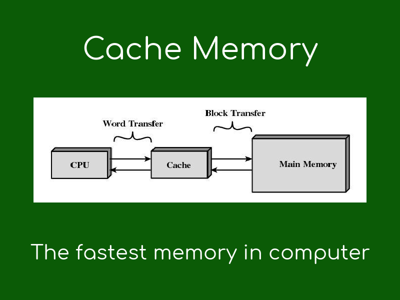

# The Computer Cache Memory
[^1]

In the past, most computers had cache memory on the motherboard and were a small block of RAM. This enhances performance by pre-loading information. It is considered as a small-capacity high-speed buffer and holds the copies of most used values in computer memory. Currently, cache memory is built into the processor and we don’t have to worry about additional components on a motherboard[^2]. 

[^1]:https://www.geekboots.com/story/what-is-cache-memory
[^2]:https://turbofuture.com/computers/the-motherboard-components
