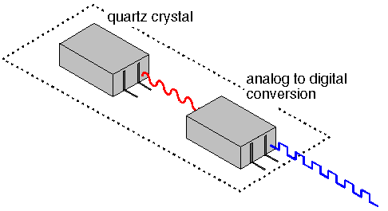

# The CPU Clock
The CPU Clock's role is to synchronize the operations in time and provide the right signal for the CPU. Everything is calculated in Hz, for example, a clock of 3.2 GHz executes 3.2 billion cycles per second. This is basically the measurement of how efficient a computer is. The processor can have either a faster or slower clock and this can determine which one is better. This also determines how hard our processor is running and it allows it to cool it down if we reach the maximum. This prevents any damage to our components. However, there are options in the BIOS that can boost up our processor. Many gamers decide to use this, however it is not always recommended. It is called overclocking and it means to  increase the number of computation by your processor. The cost of that is usually the temperature of the processor and other components nearby. As  mentioned, in general it is not recommended and can lead to severe damage to your computer. However, some producers will allow for this kind of operation and provide specific information about how to avoid the damage. But a great cooling system is definitely the most important thing[^1]. 

[^2]

[^1]:https://www.intel.com/content/www/us/en/gaming/resources/cpu-clock-speed.html
[^2]:https://www.computerlanguage.com/results.php?definition=CPU+clock
