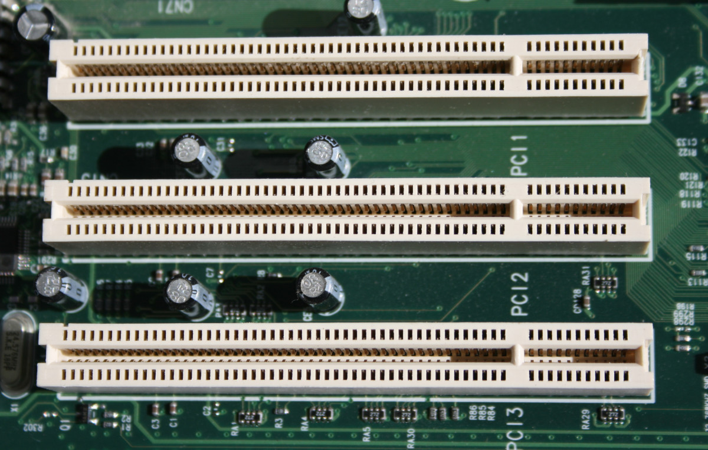

# The Expansion Buses

An expansion bus, typically made up of a series of slots on the motherboard, allows the CPU to communicate with peripheral devices (input/output). They are essential as basic PC system does not have all the features. The expansion buses allow us for adding additional attributes to our PC such as sound cards, video cards, SCSI controller cards, network interference cards[^1].

- There are several different expansion buses that provide different features.
- Industry Standard Architecture (ISA)
- Accelerated Graphics Port (AGP)
- Peripheral Component Interconnect (PCI)
- PCI Express (PCI-X)[^2]

ISA provides a basic route for the input/output devices that are attached to the motherboard to communicate with different circuits or other devices attached to the same motherboard[^3]. AGP is for additional graphics and it can assist in acceleration of 3D graphics[^4]. The most common is PCI which allows to add-on controller cards and other devices to a computer motherboard[^5].  PCI-X has similar function as PCI (uses the same protocol) but it has an additional expansion card[^6]. 

 [^7]

[^1]:https://www.geeksforgeeks.org/expansion-buses-in-pcs/
[^2]:https://www.techopedia.com/definition/306/expansion-bus
[^3]:https://www.techopedia.com/definition/5298/industry-standard-architecture-isa
[^4]:https://en.wikipedia.org/wiki/Accelerated_Graphics_Port
[^5]:https://www.lacie.com/support/kb/identify-a-variety-of-pci-slots-006353en/
[^6]:https://www.geeksforgeeks.org/difference-between-pci-and-pci-x/
[^7]:https://turbofuture.com/computers/buses
